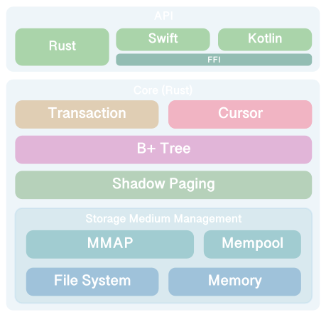
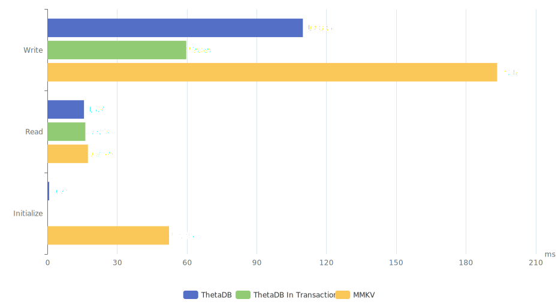

<div align="center">


[](https://crates.io/crates/thetadb)
[](https://cocoapods.org/pods/ThetaDB)

[](https://codecov.io/gh/TangentW/ThetaDB)

A lightweight, embedded key-value database for mobile clients (i.e., iOS, Android), written in Rust.

*⚠️ Still in testing, not yet ready for production use.*

</div>

## Overview

`ThetaDB` is suitable for use on mobile clients with **"High-Read, Low-Write"** demands, it uses B+ Tree as the foundational layer for index management.

Inspired by Go's [BoltDB](https://github.com/boltdb/bolt), ThetaDB uses `mmap`, relying on the operating system to keep memory and database files in sync. ThetaDB also implements `shadow paging` to guarantee atomicity and durability of transactions, preventing data loss or damage to the internal structures of database.

<div align="center">


Architecture
</div>

## Installation

ThetaDB provides APIs for these languages: `Rust`, `Swift`, `Kotlin`.

### Rust - Cargo

Add `Thetadb` as a dependency to your `Cargo.toml`:

```toml
[dependencies]
thetadb = 0.0.1
```

### Swift - Package Manager

Add `ThetaDB` as a dependency to your `Package.swift`:

```swift
.package(url: "https://github.com/TangentW/ThetaDB.git", from: "0.0.1")
```

And then specify `ThetaDB` as a dependency of the Target in which you wish to use ThetaDB.

### Swift - CocoaPods

Add the pod to your `Podfile`:

```ruby
pod 'ThetaDB'
```

And then execute:

```
$ pod install
```

### Kotlin

🚧 Yet To Be Developed.

## Usage

ThetaDB's APIs are generally similar regardless of the language used.

### Open Database

Use following way to open the database at the specified path. If the database file does not exist, ThetaDB will automatically create and initialize it.

<details open>
<summary><b>Rust Examples</b></summary>

```rust
use thetadb::{Options, ThetaDB};

let path = "path/to/db.theta";

// The simplest way to open with default `Options`:
let db = ThetaDB::open(path)?;

// Open with `Options`:
let db = Options::new()
    .force_sync(true)
    .mempool_capacity(8)
    .open(path)?;
```

</details>

<details open>
<summary><b>Swift Examples</b></summary>

```swift
import ThetaDB

let path = "path/to/db.theta"

// The simplest way to open with default `Options`:
let db = try ThetaDB(path: path)

// Open with `Options`:
let db = try ThetaDB(
    path: path,
    options: .init(
        forceSync: true,
        mempoolCapacity: 8
    )
)
```

</details>

ThetaDB has no specific requirements for filename and extension, but it is recommended to use `theta` as extension for easy identification.

ThetaDB will automatically close when the database instance is destroyed.

### Get, Insert, Update, Delete

<details open>
<summary><b>Rust Examples</b></summary>

```rust
// Insert a new key-value pair into database.
db.put(b"foo", b"foo")?;

// Check if the database contains a given key.
assert!(db.contains(b"foo")?);
assert!(!db.contains(b"unknown")?);

// Get the value associated with a given key.
assert_eq!(
    db.get(b"foo")?,
    Some(b"foo".to_vec())
);
assert_eq!(
    db.get(b"unknown")?,
    None
);

// Update an existing value associated with a given key.
db.put(b"foo", b"bar")?;
assert_eq!(
    db.get(b"foo")?,
    Some(b"bar".to_vec())
);

// Delete an existing key-value pair from database.
db.delete(b"foo")?;
assert!(!db.contains(b"foo")?);
assert_eq!(
    db.get(b"foo")?,
    None
);
```

</details>

<details open>
<summary><b>Swift Examples</b></summary>

```swift
// Insert a new key-value pair into database.
try db.put("foo".data(using: .utf8)!, for: "foo")

// Check if the database contains a given key.
assert(try db.contains("foo"))
assert(try !db.contains("unknown"))

// Get the value associated with a given key.
assertEq(
    try db.get("foo"),
    "foo".data(using: .utf8)
)
assertEq(
    try db.get("unknown"),
    nil
)

// Update an existing value associated with a given key.
try db.put("bar".data(using: .utf8)!, for: "foo")
assertEq(
    try db.get("foo"),
    "bar".data(using: .utf8)
)

// Delete an existing key-value pair from database.
try db.delete("foo")
assert(try !db.contains("foo"))
assertEq(
    try db.get("foo"),
    nil
)
```

</details>

### Transaction

ThetaDB has two kinds of transactions: `Read-Only Transaction` and `Read-Write Transaction`. The read-only transaction allows for read-only access and the read-write transaction allows modification.

ThetaDB allows a number of read-only transactions at a time but allows at most one read-write transaction at a time. When a read-write transaction is committing, it has exclusive access to the database until the commit is completed, at which point other transactions trying to access the database will be blocked. You can think of this situation as `shared access` and `exclusive access` to reader-writer lock.

#### Read-Only Transaction

<details open>
<summary><b>Rust Examples</b></summary>

```rust 
// Start a read-only transaction.
let tx = db.begin_tx()?;

// Then perform read-only access.
_ = tx.contains(b"foo")?;
_ = tx.get(b"foo")?;

// Or you can perform a read-only transaction using closure,
// with `view` method:
db.view(|tx| {
    _ = tx.contains(b"foo")?;
    _ = tx.get(b"foo")?;
    Ok(())
})?;
```

</details>

<details open>
<summary><b>Swift Examples</b></summary>

```swift
// Start a read-only transaction.
let tx = try db.beginTx()

// Then perform read-only access.
_ = try tx.contains("foo")
_ = try tx.get("foo")

// Or you can perform a read-only transaction using closure,
// with `view` method:
try db.view {
    _ = try $0.contains("foo")
    _ = try $0.get("foo")
}
```

</details>

#### Read-Write Transaction

ThetaBD's read-write transactions are designed to automatically rollback, and therefore any changes made to the transaction will be discarded unless you explicity call the `commit` method. 

Or you can perform a read-write transaction using closure, if no errors occur, then the transaction will be commit automatically after the closure call.

<details open>
<summary><b>Rust Examples</b></summary>

```rust 
// Start a read-write transaction.
let mut tx = db.begin_tx_mut()?;

// Then perform read-write access.
tx.put(b"hello", b"world")?;
_ = tx.get(b"hello")?;

// Finally, commit the transaction.
tx.commit()?;

// Or you can perform a read-write transaction using closure,
// with `update` method:
db.update(|tx| {
    tx.put(b"hello", b"world")?;
    _ = tx.get(b"hello")?;
    Ok(())
})?;
```

</details>

<details open>
<summary><b>Swift Examples</b></summary>

```swift
// Start a read-write transaction.
let tx = try db.beginTxMut()

// Then perform read-write access.
try tx.put("world".data(using: .utf8)!, for: "hello")
_ = try tx.get("hello")

// Finally, commit the transaction.
try tx.commit()

// Or you can perform a read-write transaction using closure,
// with `update` method:
try db.update {
    try $0.put("world".data(using: .utf8)!, for: "hello")
    _ = try $0.get("hello")
}
```

</details>

#### Attention

❗️ Transaction instances are nonsendable, which means it's not safe to send them to another thread. Rust leverages `Ownership` system and the `Send` and `Sync` traits to enforce requirements automatically, whereas Swift requires us to manually ensure these guarantees.

❗️ Read-only transactions and read-write transaction must not overlap, otherwise a deadlock will be occurred.

😺 So ThetaDB recommends that if you want to use transactions, use the APIs with closure parameter (i.e., `view`, `update`).

### Cursor

We can freely traverse the data in the ThetaDB using `Cursor`.

For instance, we can iterate over all the key-value pairs in the ThetaDB like this:

<details open>
<summary><b>Rust Examples</b></summary>

```rust 
// Forward traversal.
let mut cursor = db.first_cursor()?;
while let Some((key, value)) = cursor.key_value()? {
    println!("{:?} => {:?}", key, value);
    cursor.next()?;
}

// Backward traversal.
let mut cursor = db.last_cursor()?;
while let Some((key, value)) = cursor.key_value()? {
    println!("{:?} => {:?}", key, value);
    cursor.prev()?;
}
```

</details>

<details open>
<summary><b>Swift Examples</b></summary>

```swift
// Forward traversal.
let cursor = try db.firstCursor()
while let (key, value) = try cursor.keyValue() {
    print("\(key) => \(value)")
    try cursor.next()
}

// Backward traversal.
let cursor2 = try db.lastCursor()
while let (key, value) = try cursor2.keyValue() {
    print("\(key) => \(value)")
    try cursor2.previous()
}
```

</details>

Or we can perform range queries on ThetaDB in this way:

<details open>
<summary><b>Rust Examples</b></summary>

```rust 
let mut cursor = db.cursor_from_key(b"C")?;
// Enable `let_chains` feature, should add `#![feature(let_chains)]`
// to the crate attributes.
while let Some((key, value)) = cursor.key_value()? && key != b"G" {
    println!("{:?} => {:?}", key, value);
    cursor.next()?;
}
```

</details>

<details open>
<summary><b>Swift Examples</b></summary>

```swift
let cursor = try db.cursor(key: "C")
while let (key, value) = try cursor.keyValue(), key != "G" {
    print("\(key) => \(value)")
    try cursor.next()
}
```

</details>

#### Attention

❗️ Cursor is also a transaction (can be understood as a read-only transaction), so it also follows the transaction considerations mentioned above.

## Benchmark



|      Lib      | Write (ms) | Read (ms) | Initialize (ms) |
| :-----------: | :--------: | :-------: | :-------------: |
|    ThetaDB    |   109.85   |   15.70   |      0.72       |
| ThetaDB In Tx |   59.69    |   16.27   |       N/A       |
|     MMKV      |   193.41   |   17.39   |      52.28      |

### Measure

Running on iPhone 12 mini 128 GB, iOS 16.1.2.

* **Write**

    Measure: `Put 10000 records with 5000 random keys and values from 1 to 10000 in bytes length.`

    ```swift
    for i in 1 ... 10000 {
        let key = String(arc4random_uniform(5000))
        let value = Data(repeating: 1, count: i)
        // Put key-value...
    }
    ```

* **Read**

    1. Put 10000 records with 5000 random keys and values from 1 to 10000 in bytes length.
    2. Measure: `Get 10000 records with 5000 random keys.`

    ```swift
     for _ in 0 ..< 10000 {
        let key = String(arc4random_uniform(5000))
        // Get record...
     }
    ```

* **Initialization**

    1. Put 10000 records with 5000 random keys and values from 1 to 10000 in bytes length.
    2. Measure: `Open then read a record with a random key.`

## License

ThetaDB is released under the MIT license. See LICENSE for more details.
